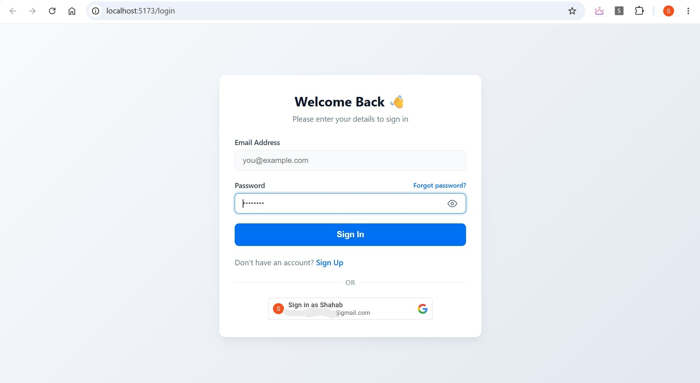
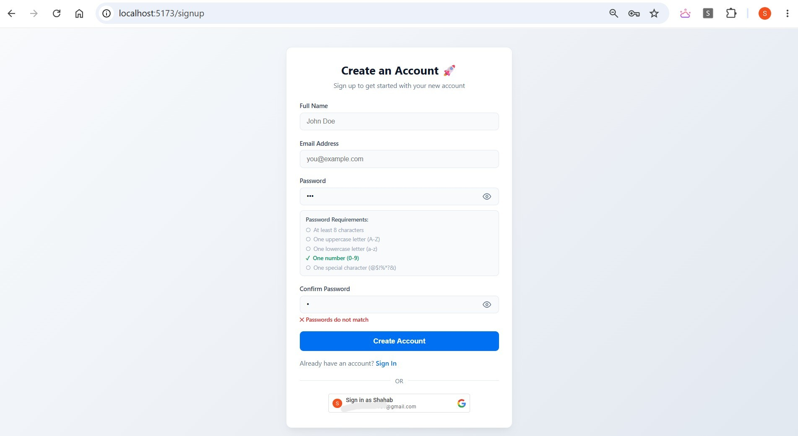
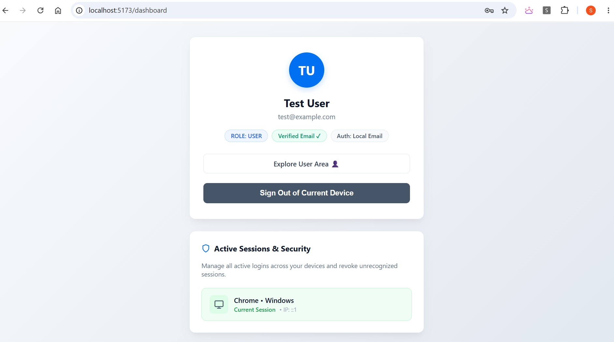
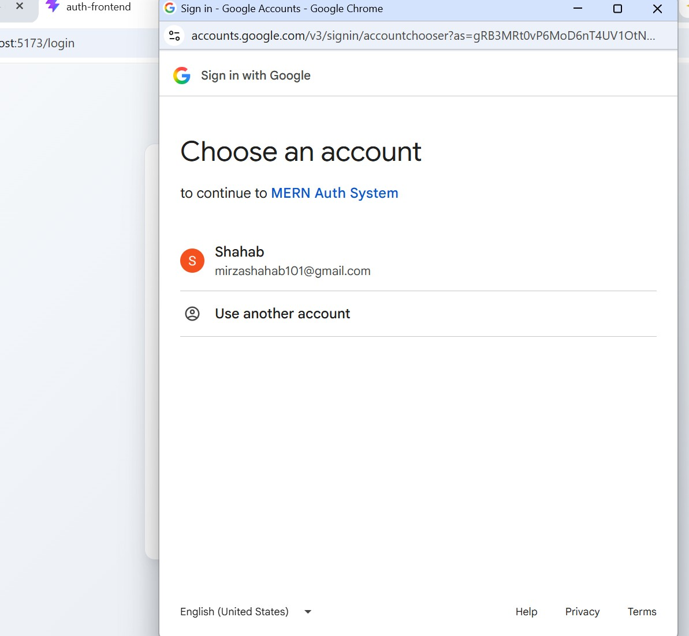
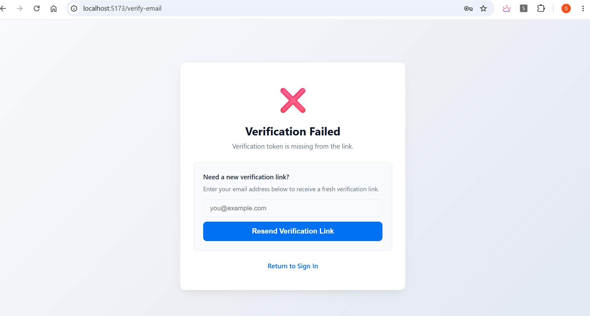
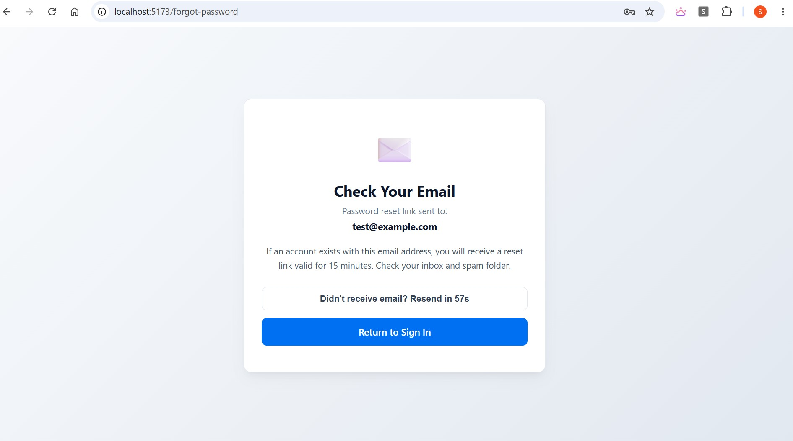
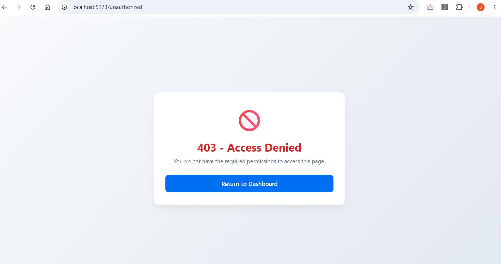

# MERN Authentication & Authorization System

A production-grade, full-stack authentication system built with the MERN stack.
Engineered beyond tutorial-level auth — featuring Dual JWT Token Rotation,
Refresh Token Reuse Detection, Google OAuth, Email Verification, Session
Management, and layered Defense-in-Depth security patterns.


---

## What Makes This Different

Most authentication tutorials stop at "store the token in localStorage and
check it on each route." This system is built the way authentication works
in production environments:

- **Access tokens live in memory** — not localStorage, not sessionStorage
- **Refresh tokens rotate on every use** — a replayed token triggers
  account-wide session revocation
- **Password resets invalidate all active access tokens instantly** — even
  ones that haven't expired yet
- **Session enumeration, account probing, and timing attacks** are all
  addressed at the design level

---

## Feature Overview

### Dual JWT Token Architecture

| Token         | Lifetime   | Storage                 | Scope                    |
| :------------ | :--------- | :---------------------- | :----------------------- |
| Access Token  | 10 minutes | In-memory (React state) | All protected API routes |
| Refresh Token | 7 days     | HttpOnly Cookie         | `/api/auth` path only    |

- Access tokens carry minimal payload: `id` and `role`
- Refresh tokens are strictly single-use and rotated on every `/refresh` call
- Cookie is scoped with `HttpOnly`, `SameSite=Strict`, and `path: "/api/auth"`
  to minimize attack surface

### Refresh Token Reuse Detection & Mass Revocation

When a refresh token is used, it is immediately invalidated and replaced.
If an already-used token is presented again — indicating potential theft —
the system **revokes all active sessions for that account simultaneously**.
No configuration required. No manual intervention.

### Instant Access Token Revocation After Password Reset

Access tokens are stateless by design, which normally means you cannot
revoke them before expiry. This system solves that by:

1. Stamping `passwordChangedAt` on the user document during a password reset
2. Comparing the JWT `iat` (issued-at) claim against `passwordChangedAt`
   in the auth middleware on every protected request
3. Rejecting any token issued before the password change — across all
   devices, instantly

### Session Management

- Active sessions capped at **5 per user** (oldest pruned automatically)
- Expired tokens (older than 7 days) are automatically removed via
  `$pull` on login and refresh
- Users can view all active sessions, revoke individual sessions, or
  revoke all sessions except their current one via dedicated API endpoints

### Email Verification Workflow

- SHA-256 hashed verification tokens with **15-minute expiration**
- Resend verification endpoint for expired tokens
- Already-verified link clicks return a clean informational message
  instead of a generic error
- Password resets blocked for unverified accounts

### Google OAuth Integration

- Sign in and sign up via Google ID Token (`google-auth-library`)
- Google accounts are auto-verified (`isVerified: true`)
- Local login attempts on Google-only accounts return a clear,
  actionable error message instead of a generic auth failure

### Defense-in-Depth Security Patterns

| Threat                                 | Mitigation                                                                                                   |
| :------------------------------------- | :----------------------------------------------------------------------------------------------------------- |
| XSS token theft                        | Access token in memory only                                                                                  |
| CSRF attacks                           | SameSite cookie + scoped path                                                                                |
| Account enumeration on login           | Generic HTTP 401 for both missing user and wrong password                                                    |
| Account enumeration on forgot password | Generic success response regardless of email existence                                                       |
| Accidental sensitive field exposure    | `select: false` on `password`, `refreshTokens`, `verificationToken`, `resetPasswordToken` in Mongoose schema |
| Weak passwords                         | Complexity enforced on both backend (express-validator) and frontend                                         |
| Session fixation                       | Full token rotation on every refresh                                                                         |

### Frontend Architecture

- **AuthContext**: Centralized state for user object, access token, and
  loading state
- **Axios Interceptors**: Automatic `Bearer` header injection and silent
  token refresh on `401` responses — transparent to all API call services
- **ProtectedRoute**: Blocks unauthenticated access to private pages
- **GuestRoute**: Redirects authenticated users away from login/signup pages

---

## Screenshots

|                            Login                            |                         Register                          |
| :---------------------------------------------------------: | :-------------------------------------------------------: |
|                       |               |
|                        **Dashboard**                        |                        **Google**                         |
|                    |      |
|                **Signup Email Verification**                |                    **Forgot Password**                    |
|  |  |
|                      **Unauthorized**                       |                                                           |
|            |                                                           |

---

## Tech Stack

| Layer           | Technology                                               |
| :-------------- | :------------------------------------------------------- |
| Backend Runtime | Node.js v18+, Express 5                                  |
| Database        | MongoDB, Mongoose                                        |
| Frontend        | React 19, Vite, React Router v7                          |
| HTTP Client     | Axios with Interceptors                                  |
| Auth & Security | jsonwebtoken, bcrypt, google-auth-library, cookie-parser |
| Email           | Nodemailer                                               |
| Validation      | express-validator                                        |

---

## Repository Structure

```text
Auth System/
├── auth-backend/
│   ├── src/
│   │   ├── config/          # Environment config & DB connection
│   │   ├── controllers/     # Route handler functions
│   │   ├── middleware/      # Auth, validation & error middleware
│   │   ├── models/          # Mongoose User schema
│   │   ├── repositories/    # Database abstraction layer
│   │   ├── routes/          # Express route definitions
│   │   ├── services/        # Business logic & email services
│   │   ├── utils/           # JWT, crypto & Google OAuth utilities
│   │   └── validators/      # express-validator rule sets
│   ├── .env.example
│   ├── package.json
│   └── server.js
│
└── auth-frontend/
    ├── src/
    │   ├── api/             # Axios instance & in-memory token manager
    │   ├── components/      # ProtectedRoute, GuestRoute, GoogleLoginButton
    │   ├── context/         # AuthContext provider & useAuth hook
    │   ├── pages/           # Login, Register, VerifyEmail, ForgotPassword,
    │   │                    # ResetPassword, Dashboard
    │   └── services/        # API call service functions
    ├── .env.example
    ├── package.json
    └── vite.config.js
```

## Getting Started

### Prerequisites

- Node.js v18+
- MongoDB (local instance or MongoDB Atlas URI)
- SMTP credentials (Mailtrap recommended for development)
- Google OAuth Client ID (for Google Sign-In)

### 1. Clone the Repository

```bash
git clone https://github.com/your-username/mern-auth-system.git
cd mern-auth-system
```

### 2. Backend Setup

```bash
cd auth-backend
npm install
cp .env.example .env
# Fill in your environment variables
npm run dev
```

Backend runs at: `http://localhost:5000`

### 3. Frontend Setup

```bash
cd auth-frontend
npm install
cp .env.example .env
# Set VITE_API_URL=http://localhost:5000/api
npm run dev
```

Frontend runs at: `http://localhost:5173`

---

## API Reference

### Auth Endpoints

| Method   | Endpoint                        | Description                 | Security Notes                    |
| :------- | :------------------------------ | :-------------------------- | :-------------------------------- |
| `POST`   | `/api/auth/signup`              | Register new account        | Password complexity enforced      |
| `GET`    | `/api/auth/verify-email`        | Verify email address        | SHA-256 token, 15min expiry       |
| `POST`   | `/api/auth/resend-verification` | Resend verification email   | Enumeration-safe response         |
| `POST`   | `/api/auth/login`               | Authenticate & issue tokens | Generic 401, Google account guard |
| `POST`   | `/api/auth/google-login`        | Authenticate via Google     | ID Token verified server-side     |
| `POST`   | `/api/auth/google-signup`       | Register via Google         | Auto-verified account             |
| `POST`   | `/api/auth/refresh`             | Rotate token pair           | Reuse detection & mass revocation |
| `POST`   | `/api/auth/logout`              | Clear session               | Scoped cookie cleared             |
| `GET`    | `/api/auth/me`                  | Get current user profile    | Bearer token required             |
| `POST`   | `/api/auth/forgot-password`     | Request password reset      | Verified accounts only            |
| `POST`   | `/api/auth/reset-password`      | Reset password              | Revokes all tokens on success     |
| `GET`    | `/api/auth/sessions`            | List active sessions        | Tokens hidden, current marked     |
| `DELETE` | `/api/auth/sessions/other`      | Revoke all other sessions   | Keeps current session             |
| `DELETE` | `/api/auth/sessions/:sessionId` | Revoke specific session     | Individual session control        |

### RBAC Endpoints

| Method | Endpoint               | Description        | Required Role     |
| :----- | :--------------------- | :----------------- | :---------------- |
| `GET`  | `/api/rbac/user-area`  | User area access   | `user` or `admin` |
| `GET`  | `/api/rbac/admin-area` | Admin panel access | `admin` only      |

---

## Security Considerations for Production

- Set `NODE_ENV=production` to enable secure cookie flags
- Use strong, unique secrets for `JWT_ACCESS_SECRET` and `JWT_REFRESH_SECRET`
- Configure a real SMTP provider (SendGrid, AWS SES, Postmark) to replace Mailtrap
- Place the application behind HTTPS — `Secure` cookie flag requires it
- Consider rate limiting auth endpoints with `express-rate-limit`
- Review CORS configuration in `server.js` before deploying

---

## License

MIT — feel free to use this as a reference or starting point for your projects.
